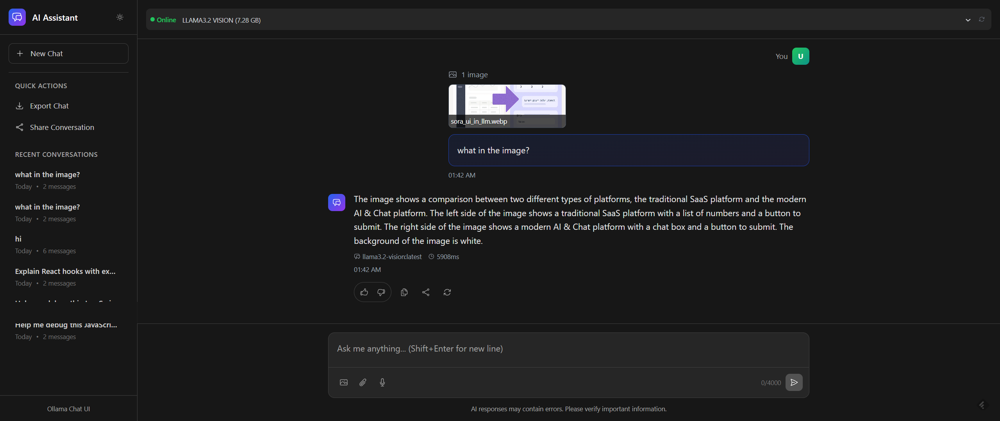

# ChatUI

A beautiful, modern chat interface for interacting with your local Ollama server. This is a clean alternative to ChatGPT that runs entirely on your local machine.



## Features

- 🎨 **Beautiful UI** - Dark/light mode with smooth animations
- 🔄 **Real-time Streaming** - See responses as they're generated
- 🤖 **Model Selection** - Switch between different Ollama models
- 📱 **Responsive Design** - Works on desktop and mobile
- 💾 **Export Chats** - Save your conversations as JSON
- 🚀 **Fast & Local** - No external dependencies, runs on your machine

## Prerequisites

1. **Install Ollama**: Download and install from [ollama.ai](https://ollama.ai)
2. **Download a Model**: Run `ollama pull llama2` (or any model you prefer)
3. **Start Ollama Server**: The server should auto-start, or run `ollama serve`

## Installation

1. Clone this repository:

```bash
git clone <your-repo-url>
cd chatui
```

2. Install dependencies:

```bash
npm install
# or
pnpm install
# or
yarn install
```

3. Start the development server:

```bash
npm run dev
# or
pnpm dev
# or
yarn dev
```

4. Open [http://localhost:5173](http://localhost:5173) in your browser

## Configuration

### Ollama Server URL

By default, the app connects to `http://localhost:11434`. If your Ollama server runs on a different port or host, you can modify the `baseUrl` in `src/services/ollamaApi.ts`:

```typescript
const ollamaApi = new OllamaApiService("http://your-ollama-host:port");
```

### Default Model

You can set a default model in `src/hooks/useChatUI.ts`:

```typescript
export const useChatUI = (defaultModel: string = 'your-preferred-model') => {
```
