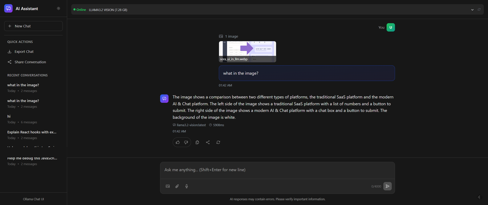

# Ollama Chat UI

A beautiful, modern chat interface for interacting with your local Ollama server. This is a clean alternative to ChatGPT that runs entirely on your local machine.



## Features

- 🎨 **Beautiful UI** - Dark/light mode with smooth animations
- 🔄 **Real-time Streaming** - See responses as they're generated
- 🤖 **Model Selection** - Switch between different Ollama models
- 📱 **Responsive Design** - Works on desktop and mobile
- 💾 **Export Chats** - Save your conversations as JSON
- 🚀 **Fast & Local** - No external dependencies, runs on your machine

## Prerequisites

1. **Install Ollama**: Download and install from [ollama.ai](https://ollama.ai)
2. **Download a Model**: Run `ollama pull llama2` (or any model you prefer)
3. **Start Ollama Server**: The server should auto-start, or run `ollama serve`

## Installation

1. Clone this repository:

```bash
git clone <your-repo-url>
cd ollama-chat
```

2. Install dependencies:

```bash
npm install
# or
pnpm install
# or
yarn install
```

3. Start the development server:

```bash
npm run dev
# or
pnpm dev
# or
yarn dev
```

4. Open [http://localhost:5173](http://localhost:5173) in your browser

## Configuration

### Ollama Server URL

By default, the app connects to `http://localhost:11434`. If your Ollama server runs on a different port or host, you can modify the `baseUrl` in `src/services/ollamaApi.ts`:

```typescript
const ollamaApi = new OllamaApiService("http://your-ollama-host:port");
```

### Default Model

You can set a default model in `src/hooks/useOllamaChat.ts`:

```typescript
export const useOllamaChat = (defaultModel: string = 'your-preferred-model') => {
```

## Available Models

The app will automatically detect all models installed on your Ollama server. Popular models include:

- **llama2** - General purpose model
- **codellama** - Code generation and understanding
- **mistral** - Fast and efficient model
- **phi** - Lightweight model for quick responses

To install a new model:

```bash
ollama pull model-name
```

## Troubleshooting

### \"Ollama server is not running\"

1. Make sure Ollama is installed and running
2. Check if the server is accessible at `http://localhost:11434`
3. Try running `ollama serve` manually

### \"No models available\"

1. Install at least one model: `ollama pull llama2`
2. Refresh the models list using the refresh button
3. Check that Ollama server is running properly

### CORS Issues

If you encounter CORS errors, make sure your Ollama server allows requests from your development server. You may need to configure Ollama's CORS settings.

## Build for Production

```bash
npm run build
# or
pnpm build
# or
yarn build
```

The built files will be in the `dist` directory.

## Contributing

Feel free to submit issues and pull requests!

## License

MIT License - see LICENSE file for details.
